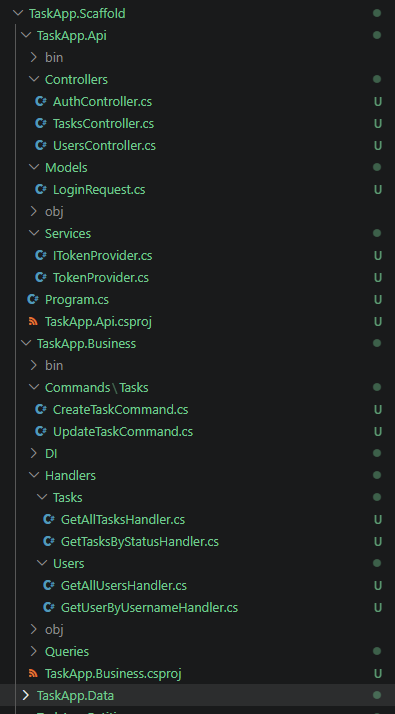
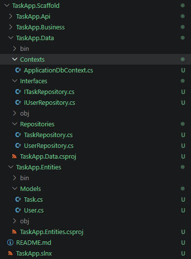

# Gen AI tools

Prompt to generate the API Scaffold for a simple task management system:
```
Act as expert developer in dotnet using entity framework and sql server. Please create a full solution for a brand new project using .Net 10 and the latest version of Entity Framework. Apply Clean Architecture methodology and repository pattern where suggested. Use the following base model:
User:
    ID (primary key, integer),
    Username (string, 100 characters max length, required)
    Password (string, 100 characters max length, required)
    IsActive (boolean, default value: true)
Task
    ID (primary key, integer),
    Name (string, 100 characters max length, required)
    Description (string, 500 characters max length, optional)
    Status (string, 10 characters max length, required)
    DueDate (DateTime, required)
    UserId (integer, foreign key with User model, required)

Create a new Visual Studio solution using the following structure:
- Entities: it will handle models and entities needed across the app.
- Data layer: use this layer to create repository classes for each model that allows you to perform CRUD operations. Install Microsoft.EntityFrameworkCore, Microsoft.EntityFrameworkCore.SqlServer and any other package needed to configure Sql Server connection using Code-First approach.
- Business layer: use this layer to create independent class to handle business logic applying CQRS pattern and then the respective call repositories to perform the operation. It should include:
Query classes to get AlllUsers, AllTasks, TasksPerStatus, UserByUsername
Command classes to perform Create and Update operations for User and Task models.
Use mediatr library to handle CQRS logic.
- API: Use this class to manage CQRS classes from Business Layer and expose each of them to an independent endpoint. Also, install and configure JWT authentication for all the controllers.
Create a UsersController to expose GetAllUsers query using an HttpGet endpoint.
Create a LoginController to handle the login logic by validating the provided username and password from the request, look for the user by using the username and calling UserByUsername query from business layer and if its true generate a valid jwt token with the user information. this Login endpoint should allow anonymous request.
Create a TaskController that allows get all the tasks, get all the tasks by status, create new tasks and update tasks, by using an independent endpoint which each of them should call its respective Query or Command from Business Layer. Use the respective Http Verb for each action.
Make the appropiate injection of dependencies on each layer so it will be able to use classes as follow:
API: Business Layer, Entities
Business Layer: Data Layer, Entities
Data Layer: Entities
Also, integrate OpenAPI by installing Swagger and configure it appropiately so all the endpoints are exposed
```

### Sample output






### Validations and refinement:

After running the prompt using Copilot and pay attenition to all the steps and confirmation messsages that the asssitant triggers, I would check the whole solution, starting by the general structure. then, I will go layer by layer to make sure all the files are generated as exepected, the naming, the logic, imports etc.. Validations might be missing so I would add them manually, as any other missing feature. I will also populate any sensitive or local configuration needed to run the project, and until then, I will run the project looking first for syntax errors, then logic/business errors. I would try to test every possible sceneario and try to cover any edge case and fix it, if any.